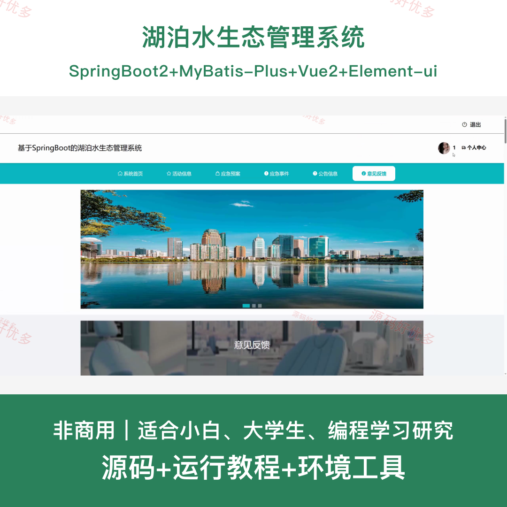
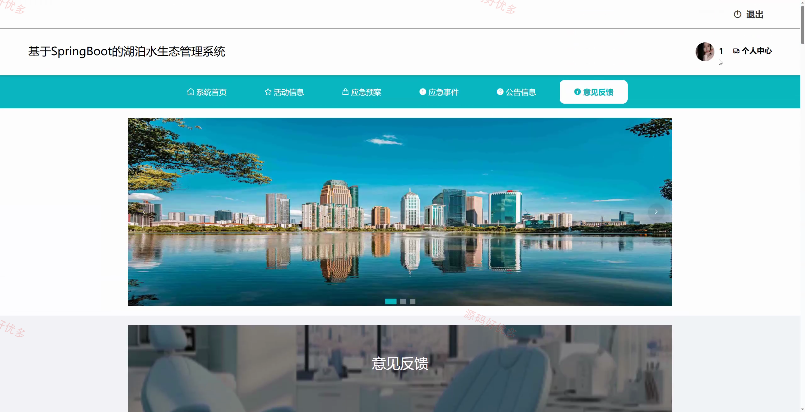
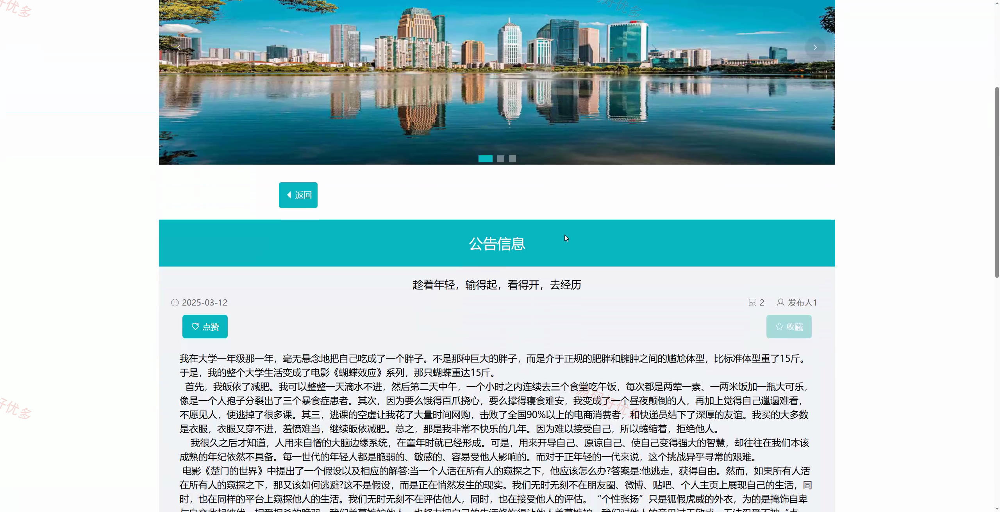
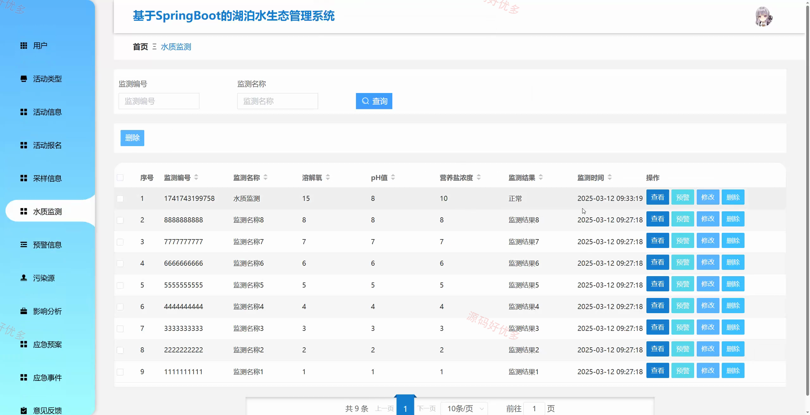
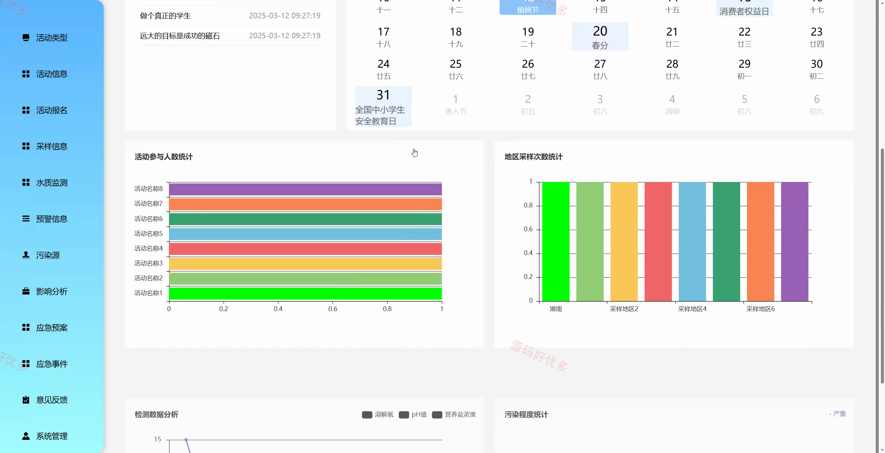
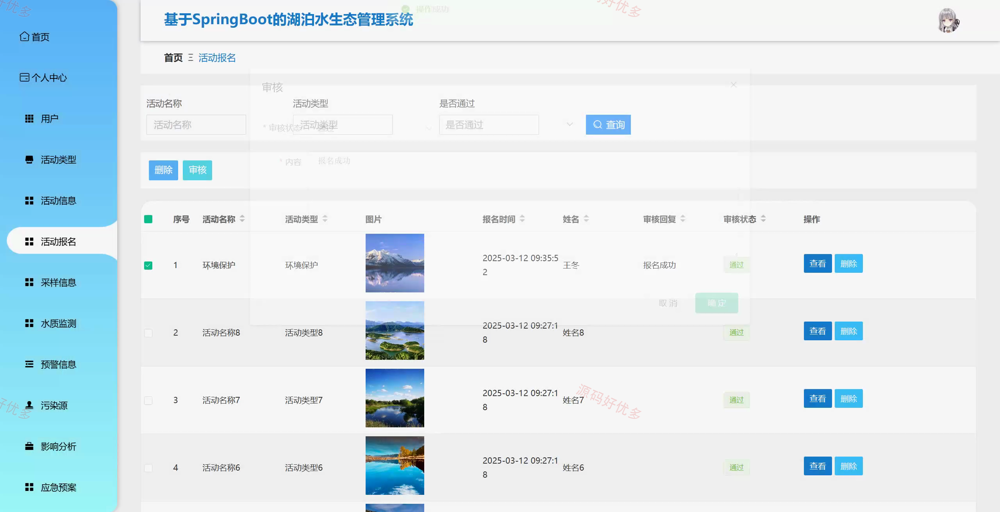
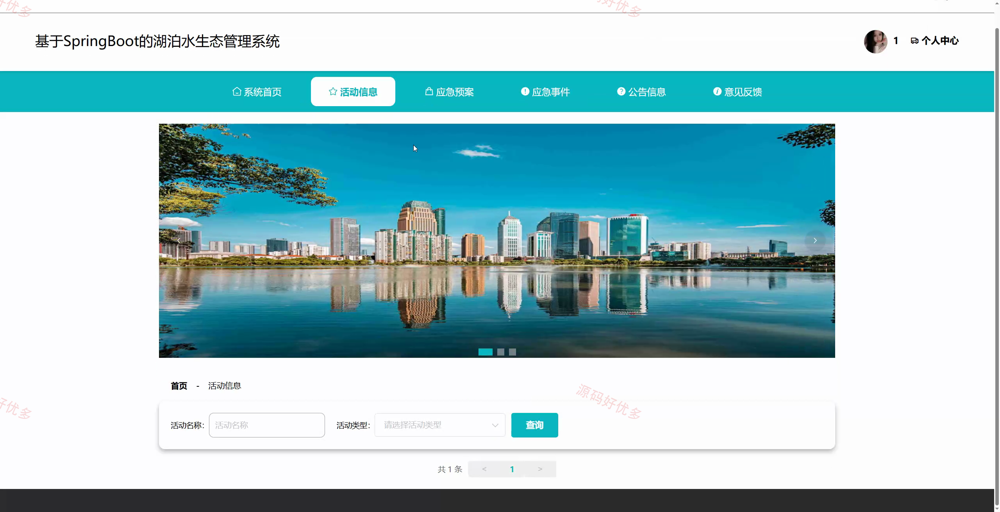
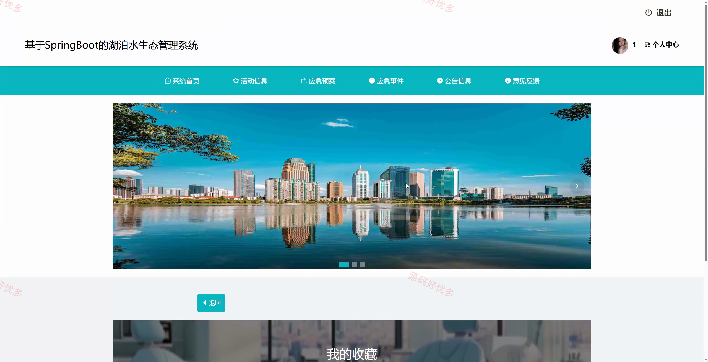
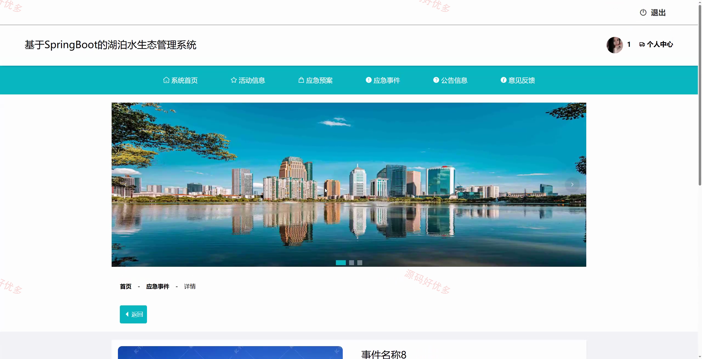

# springbootA567D
springbootA567D湖泊水生态管理系统
## 源码问题查看主页咨询

### 一、关键词
湖泊水生态管理系统、水质监测、污染源管理、应急预警、生态活动报名

### 二、作品包含
源码+数据库+全套环境和工具资源+本地部署教程

### 三、项目技术
前端技术： Html、Css、Js、Vue2.6、Element-ui
后端技术：Java、SpringBoot2.2.2、MyBatis-Plus

### 四、运行环境（以下版本亲测，其他版本兼容性请自行测试）
开发工具：IDEA/eclipse + VSCODE

数据库：MySQL5.7+（共18张表）

数据库管理工具：Navicat10以上版本

环境配置软件： JDK1.8 + Maven3.6.3

前端Nodejs：14+

浏览器：谷歌浏览器

### 五、项目介绍
项目编号：springbootA567D

湖泊水生态管理系统围绕水质监测、采样记录、污染源管理、预警信息、应急事件和生态活动报名等业务建设，帮助管理员集中维护湖泊生态数据，也方便用户查看资讯、报名活动和提交留言反馈。

角色：管理员、用户

用户功能：注册登录、公告资讯浏览、生态活动查看报名、留言反馈、预警信息查看、个人中心。

管理员功能：用户管理、水质监测管理、采样信息管理、污染源管理、预警信息管理、应急事件和应急预案管理、活动报名管理。

### 六、运行截图

